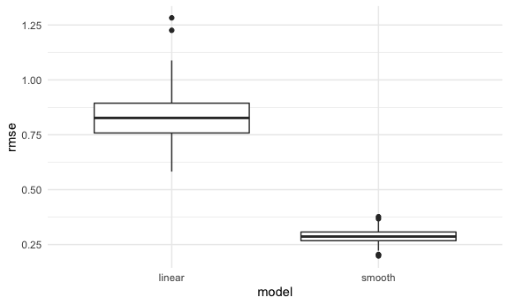
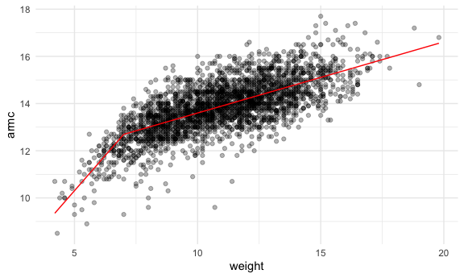

linear models
================

## step one

``` r
nonlin_df = 
  tibble(
    id = 1:100,
    x = runif(100, 0, 1),
    y = 1 - 10 * (x - .3) ^ 2 + rnorm(100, 0, .3)
  )

nonlin_df %>% 
  ggplot(aes(x = x, y = y)) + 
  geom_point()
```


Let’s get this by hand

``` r
train_df = sample_n(nonlin_df, 80)
test_df = anti_join(nonlin_df, train_df)
```

``` r
train_df %>% 
  ggplot(aes(x = x, y =y)) + 
  geom_point() + 
  geom_point(data = test_df, color = "red")
```


## Three Models

``` r
linear_mod = lm(y~x, data = train_df)
smooth_mod = mgcv::gam(y ~ s(x), data = train_df)
wiggly_mod = mgcv::gam(y ~ s(x, k = 30), sp = 10e-6, data = train_df)
```

``` r
train_df %>% 
  add_predictions(smooth_mod) %>% 
  ggplot(aes(x = x, y = y)) + geom_point() + geom_line(aes(y = pred), color = "red") + geom_point(data = test_df, color = "red")
```


\##Let’s make predictions and compute RMSEs comparing red line and red
points above

``` r
rmse(linear_mod, test_df)
```

    ## [1] 0.8045305

``` r
rmse(smooth_mod, test_df)
```

    ## [1] 0.3156661

``` r
rmse(wiggly_mod, test_df)
```

    ## [1] 0.3416015

## can we iterate ..?

``` r
cv_df =
  crossv_mc(nonlin_df, 100)

cv_df %>% pull(train) %>% .[[1]] %>% as_tibble
```

    ## # A tibble: 79 × 3
    ##       id     x      y
    ##    <int> <dbl>  <dbl>
    ##  1     1 0.691 -0.941
    ##  2     2 0.237  1.24 
    ##  3     3 0.425  0.847
    ##  4     5 0.374  0.564
    ##  5     6 0.717 -0.459
    ##  6     7 0.389  1.23 
    ##  7     9 0.205  0.832
    ##  8    10 0.953 -3.44 
    ##  9    11 0.170  0.342
    ## 10    12 0.463  0.441
    ## # … with 69 more rows

``` r
cv_df %>% pull(test) %>% .[[1]] %>% as_tibble()
```

    ## # A tibble: 21 × 3
    ##       id     x       y
    ##    <int> <dbl>   <dbl>
    ##  1     4 0.225  0.708 
    ##  2     8 0.299  0.747 
    ##  3    22 0.530  0.653 
    ##  4    26 0.618 -0.0252
    ##  5    27 0.360  1.27  
    ##  6    29 0.279  0.819 
    ##  7    36 0.412  0.546 
    ##  8    38 0.419  0.467 
    ##  9    42 0.207  0.773 
    ## 10    49 0.641 -0.239 
    ## # … with 11 more rows

## Generate multi train and test dataset

1.  add models to each row of training dataset
2.  add rmse to each model
3.  might make a boxplot of rmse following the data

``` r
cv_df = cv_df %>% 
  mutate(
    train = map(train, as_tibble),
    test = map(test, as_tibble)
  ) %>% 
  mutate(
    linear_fits = map(.x = train, ~lm(y ~ x, data = .x)),
    smooth_fits = map(.x = train, ~mgcv::gam(y ~ s(x), data = .x))
  ) %>% 
  mutate(
    rmse_linear = map2_dbl(.x = linear_fits, .y = test, ~rmse(model = .x, data = .y)),
    rmse_smooth = map2_dbl(.x = smooth_fits, .y = test, ~rmse(model = .x, data = .y))
  )

cv_df
```

    ## # A tibble: 100 × 7
    ##    train             test              .id   linear_fits smoot…¹ rmse_…² rmse_…³
    ##    <list>            <list>            <chr> <list>      <list>    <dbl>   <dbl>
    ##  1 <tibble [79 × 3]> <tibble [21 × 3]> 001   <lm>        <gam>     0.859   0.320
    ##  2 <tibble [79 × 3]> <tibble [21 × 3]> 002   <lm>        <gam>     0.748   0.305
    ##  3 <tibble [79 × 3]> <tibble [21 × 3]> 003   <lm>        <gam>     0.768   0.297
    ##  4 <tibble [79 × 3]> <tibble [21 × 3]> 004   <lm>        <gam>     0.812   0.340
    ##  5 <tibble [79 × 3]> <tibble [21 × 3]> 005   <lm>        <gam>     1.05    0.354
    ##  6 <tibble [79 × 3]> <tibble [21 × 3]> 006   <lm>        <gam>     0.835   0.260
    ##  7 <tibble [79 × 3]> <tibble [21 × 3]> 007   <lm>        <gam>     0.754   0.265
    ##  8 <tibble [79 × 3]> <tibble [21 × 3]> 008   <lm>        <gam>     0.871   0.229
    ##  9 <tibble [79 × 3]> <tibble [21 × 3]> 009   <lm>        <gam>     0.732   0.287
    ## 10 <tibble [79 × 3]> <tibble [21 × 3]> 010   <lm>        <gam>     0.927   0.232
    ## # … with 90 more rows, and abbreviated variable names ¹​smooth_fits,
    ## #   ²​rmse_linear, ³​rmse_smooth

Make a boxplot

``` r
cv_df %>% 
  select(starts_with("rmse")) %>% 
  pivot_longer(
    everything(),
    names_to = "model", 
    values_to = "rmse",
    names_prefix = "rmse_"
  ) %>% 
  ggplot(aes(x = model, y = rmse)) +
  geom_boxplot()
```


\## Child Growth Example

``` r
child_growth = read_csv("./data/nepalese_children.csv")
```

``` r
child_growth %>% 
  ggplot(aes(x = weight, y = armc)) + geom_point(alpha = .3)
```


Piecewise linear models

``` r
child_growth = 
  child_growth %>% 
  mutate(
    weight_pwl = (weight > 7) * (weight - 7) 
  )
```

``` r
linear_model = lm(armc ~ weight, data = child_growth)
pwl_model = lm(armc ~ weight + weight_pwl, data = child_growth)
smooth_model = mgcv::gam(armc ~ s(weight), data = child_growth)
```

show change of linear model before and after weight=7

``` r
child_growth %>% 
  add_predictions(pwl_model) %>% 
  ggplot(aes(x = weight, y = armc)) +
  geom_point(alpha = .3) +
  geom_line(aes(y = pred), color = "red")
```



``` r
child_growth %>% 
  add_predictions(smooth_model) %>% 
  ggplot(aes(x = weight, y = armc)) +
  geom_point(alpha = .3) +
  geom_line(aes(y = pred), color = "red")
```


``` r
cv_df = 
  crossv_mc(child_growth, 100) %>% 
  mutate(
    train = map(train, as_tibble),
    test = map(test, as_tibble)
  )
```

``` r
cv_df = cv_df %>% 
  mutate(
    linear_fits = map(.x = train, ~lm(armc ~ weight, data = .x)),
    pwl_fits = map(.x = train, ~lm(armc ~ weight + weight_pwl, data = .x)),
    smooth_fits = map(.x = train, ~mgcv::gam(armc ~ s(weight), data = .x))
  ) %>% 
  mutate(
    rmse_linear = map2_dbl(.x = linear_fits, .y = test, ~rmse(model = .x, data = .y)),
    rmse_pwl = map2_dbl(.x = pwl_fits, .y = test, ~rmse(model = .x, data = .y)),
    rmse_smooth = map2_dbl(.x = smooth_fits, .y = test, ~rmse(model = .x, data = .y))
  )
```

look into results

``` r
cv_df %>% 
  select(starts_with("rmse")) %>% 
  pivot_longer(
    everything(),
    names_to = "model", 
    values_to = "rmse",
    names_prefix = "rmse_"
  ) %>% 
  ggplot(aes(x = model, y = rmse)) +
  geom_boxplot()
```


