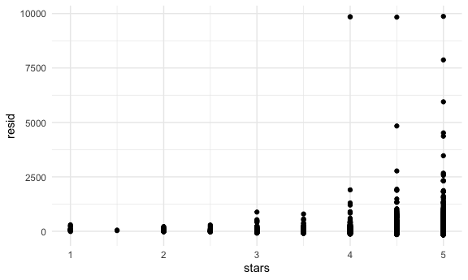
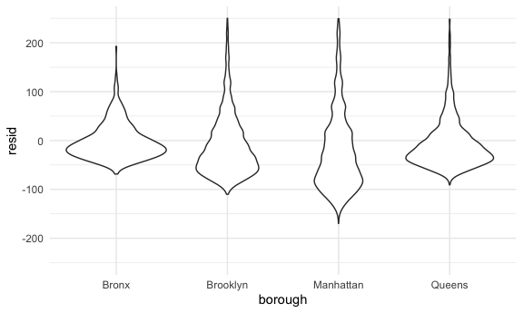

linear models
================

## homework

baltimore problem: find success and total trials

``` r
prop.test(5, 10) %>% 
  broom::tidy()
```

    ## # A tibble: 1 × 8
    ##   estimate statistic p.value parameter conf.low conf.high method         alter…¹
    ##      <dbl>     <dbl>   <dbl>     <int>    <dbl>     <dbl> <chr>          <chr>  
    ## 1      0.5         0       1         1    0.237     0.763 1-sample prop… two.si…
    ## # … with abbreviated variable name ¹​alternative

## load nyc airbnb data

``` r
data("nyc_airbnb")

nyc_airbnb = 
  nyc_airbnb %>% 
  mutate(stars = review_scores_location / 2) %>% 
  rename(
    borough = neighbourhood_group,
    neighborhood = neighbourhood) %>% 
  filter(borough != "Staten Island") %>% 
  select(price, stars, borough, neighborhood, room_type)
```

## Fit the first model

``` r
fit = lm(price ~ stars + borough, data = nyc_airbnb)

summary(fit)
```

    ## 
    ## Call:
    ## lm(formula = price ~ stars + borough, data = nyc_airbnb)
    ## 
    ## Residuals:
    ##    Min     1Q Median     3Q    Max 
    ## -169.8  -64.0  -29.0   20.2 9870.0 
    ## 
    ## Coefficients:
    ##                  Estimate Std. Error t value Pr(>|t|)    
    ## (Intercept)       -70.414     14.021  -5.022 5.14e-07 ***
    ## stars              31.990      2.527  12.657  < 2e-16 ***
    ## boroughBrooklyn    40.500      8.559   4.732 2.23e-06 ***
    ## boroughManhattan   90.254      8.567  10.534  < 2e-16 ***
    ## boroughQueens      13.206      9.065   1.457    0.145    
    ## ---
    ## Signif. codes:  0 '***' 0.001 '**' 0.01 '*' 0.05 '.' 0.1 ' ' 1
    ## 
    ## Residual standard error: 181.5 on 30525 degrees of freedom
    ##   (9962 observations deleted due to missingness)
    ## Multiple R-squared:  0.03423,    Adjusted R-squared:  0.03411 
    ## F-statistic: 270.5 on 4 and 30525 DF,  p-value: < 2.2e-16

``` r
fit %>% 
  broom::tidy() %>% 
  mutate(
    term = str_replace(term, "borough", "Borough:")
  ) %>% 
  select(term, estimate, p.value) %>% 
  knitr::kable(digits = 2)
```

| term              | estimate | p.value |
|:------------------|---------:|--------:|
| (Intercept)       |   -70.41 |    0.00 |
| stars             |    31.99 |    0.00 |
| Borough:Brooklyn  |    40.50 |    0.00 |
| Borough:Manhattan |    90.25 |    0.00 |
| Borough:Queens    |    13.21 |    0.15 |

## change reference category

now manhattan as the reference group based on frequency in borough
column

``` r
fit =
  nyc_airbnb %>% 
  mutate(
    borough = fct_infreq(borough)
  ) %>% 
  lm(price ~ stars + borough, data = .)

fit %>% 
  broom::glance() %>% 
  select(AIC)
```

    ## # A tibble: 1 × 1
    ##       AIC
    ##     <dbl>
    ## 1 404237.

## Diagositics

``` r
modelr::add_residuals(nyc_airbnb, fit) %>% 
  ggplot(aes(x = stars, y = resid)) +
  geom_point()
```



``` r
nyc_airbnb %>% 
  modelr::add_residuals(fit) %>% 
  ggplot(aes(x = borough, y = resid)) +
  geom_violin() +
  ylim(-250, 250)
```


\## Hypothesis testing

one coefficient: stars

``` r
fit %>% 
  broom::tidy()
```

    ## # A tibble: 5 × 5
    ##   term            estimate std.error statistic   p.value
    ##   <chr>              <dbl>     <dbl>     <dbl>     <dbl>
    ## 1 (Intercept)         19.8     12.2       1.63 1.04e-  1
    ## 2 stars               32.0      2.53     12.7  1.27e- 36
    ## 3 boroughBrooklyn    -49.8      2.23    -22.3  6.32e-109
    ## 4 boroughQueens      -77.0      3.73    -20.7  2.58e- 94
    ## 5 boroughBronx       -90.3      8.57    -10.5  6.64e- 26

``` r
fit_null = lm(price ~ stars, data = nyc_airbnb)
fit_alt = lm(price ~stars + borough, data = nyc_airbnb)

anova(fit_null, fit_alt) %>% 
  broom::tidy()
```

    ## # A tibble: 2 × 7
    ##   term                    df.residual       rss    df   sumsq stati…¹    p.value
    ##   <chr>                         <dbl>     <dbl> <dbl>   <dbl>   <dbl>      <dbl>
    ## 1 price ~ stars                 30528    1.03e9    NA NA          NA  NA        
    ## 2 price ~ stars + borough       30525    1.01e9     3  2.53e7    256.  7.84e-164
    ## # … with abbreviated variable name ¹​statistic

## room type by borough

Interaction?

``` r
fit =
  nyc_airbnb %>% 
  lm(price ~ stars + borough*room_type, data = .) %>% 
  broom::tidy()
```

can we fit models by borough

``` r
nyc_airbnb %>% 
  nest(df = -borough) %>% 
  mutate(
    models = map(.x = df, ~lm(price ~ stars + room_type, data = .x)),
    results = map(models, broom::tidy)
  ) %>% 
  select(borough, results) %>% 
  unnest(results)
```

    ## # A tibble: 16 × 6
    ##    borough   term                  estimate std.error statistic   p.value
    ##    <chr>     <chr>                    <dbl>     <dbl>     <dbl>     <dbl>
    ##  1 Bronx     (Intercept)              90.1      15.2       5.94 5.73e-  9
    ##  2 Bronx     stars                     4.45      3.35      1.33 1.85e-  1
    ##  3 Bronx     room_typePrivate room   -52.9       3.57    -14.8  6.21e- 41
    ##  4 Bronx     room_typeShared room    -70.5       8.36     -8.44 4.16e- 16
    ##  5 Queens    (Intercept)              91.6      25.8       3.54 4.00e-  4
    ##  6 Queens    stars                     9.65      5.45      1.77 7.65e-  2
    ##  7 Queens    room_typePrivate room   -69.3       4.92    -14.1  1.48e- 43
    ##  8 Queens    room_typeShared room    -95.0      11.3      -8.43 5.52e- 17
    ##  9 Brooklyn  (Intercept)              69.6      14.0       4.96 7.27e-  7
    ## 10 Brooklyn  stars                    21.0       2.98      7.05 1.90e- 12
    ## 11 Brooklyn  room_typePrivate room   -92.2       2.72    -34.0  6.40e-242
    ## 12 Brooklyn  room_typeShared room   -106.        9.43    -11.2  4.15e- 29
    ## 13 Manhattan (Intercept)              95.7      22.2       4.31 1.62e-  5
    ## 14 Manhattan stars                    27.1       4.59      5.91 3.45e-  9
    ## 15 Manhattan room_typePrivate room  -124.        3.46    -35.8  9.40e-270
    ## 16 Manhattan room_typeShared room   -154.       10.1     -15.3  2.47e- 52

## Quick double check

``` r
nyc_airbnb %>% 
  filter(borough == "Bronx") %>% 
  lm(price ~ stars + room_type, data = .) %>% 
  broom::tidy()
```

    ## # A tibble: 4 × 5
    ##   term                  estimate std.error statistic  p.value
    ##   <chr>                    <dbl>     <dbl>     <dbl>    <dbl>
    ## 1 (Intercept)              90.1      15.2       5.94 5.73e- 9
    ## 2 stars                     4.45      3.35      1.33 1.85e- 1
    ## 3 room_typePrivate room   -52.9       3.57    -14.8  6.21e-41
    ## 4 room_typeShared room    -70.5       8.36     -8.44 4.16e-16
